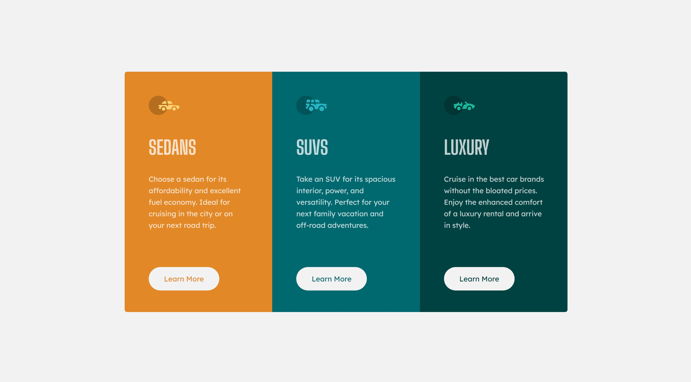

# Frontend Mentor - 3-column preview card component solution

This is a solution to the [3-column preview card component challenge on Frontend Mentor](https://www.frontendmentor.io/challenges/3column-preview-card-component-pH92eAR2-). Frontend Mentor challenges help you improve your coding skills by building realistic projects. 

## Table of contents

- [Overview](#overview)
  - [The challenge](#the-challenge)
  - [Screenshot](#screenshot)
  - [Links](#links)
- [My process](#my-process)
  - [Built with](#built-with)
  - [What I learned](#what-i-learned)
  - [Continued development](#continued-development)
- [Author](#author)

## Overview

### The challenge

Users should be able to:

- View the optimal layout depending on their device's screen size
- See hover states for interactive elements

### Screenshot

### Links

- [Solution](https://github.com/jxpettigrew/3-column-preview-card-component)
- [Live Site](https://jxpettigrew.github.io/3-column-preview-card-component/)

## My process

### Built with

- CSS custom properties
- Flexbox

### What I learned

On this one, I learned that best practice is not to give buttons values for height or width, only padding. This seems to ensure the text won't overflow the button borders.

### Continued development

This was just meant as a quick little project to apply some things I've already learned, but I definitely want to get involved with more complex flexbox and grid designs on my next project(s). Also intend to start adding some interactivity with Javascript very soon.

## Author

- Frontend Mentor - [@jxpettigrew](https://www.frontendmentor.io/profile/jxpettigrew)
- Twitter - [@jxpettigrew](https://twitter.com/jxpettigrew)